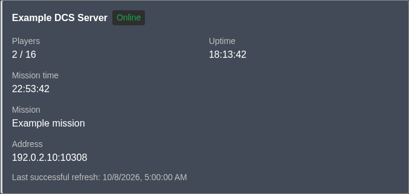

# DCS Server Status plugin

A Discourse plugin that displays one Eagle Dynamics DCS server as a live card inside a post. Targeted and tested against Discourse **2026.10.0-latest**; older releases are not supported.

Put this on its own line, outside a code block:

```text
[dcs-status]
```

In the rich-text editor, typing or pasting this as a separate paragraph creates a status placeholder and saves the shortcode without escaping its brackets. Code examples and inline mentions of the shortcode stay literal. If an older post saved it as `\[dcs-status\]`, switch that post to Markdown editing and remove the backslashes.

The card shows the server name, whether ED lists it, player count/capacity, mission uptime, optional calculated in-game mission clock, mission, connection address, and last successful refresh. All cards refer to the single server configured by an admin, including cards in old posts. An optional desktop header badge keeps a compact summary visible while browsing; mobile visitors can open details from a fighter icon beside search. There is no bot account.

Colors inherit the forum's active Discourse theme, including light and dark palettes. No separate color configuration is required.

Example card with sample data in a dark theme:



[View the mobile example](docs/images/status-card-mobile.png).

## Installation

For a standard self-hosted Discourse Docker installation, add this entry to the existing plugin clone list under `hooks: after_code: exec: cmd:` in `/var/discourse/containers/app.yml`:

```yaml
- git clone https://github.com/<owner>/discourse-dcs-server-status.git
```

Replace `<owner>` with the account hosting the plugin repository. Then rebuild from the Discourse installation directory:

```sh
cd /var/discourse
./launcher rebuild app
```

Use your actual container name if it is not `app`. The rebuild briefly interrupts forum availability. It installs the plugin disabled by default.

## Configure and try it

1. Create a dedicated ED account and confirm it can access the server list when logged in. Do not use an account with purchased modules for monitoring.
2. In **Admin → Plugins → DCS Server Status plugin → Settings**, enter the ED username, ED password, and full server name exactly as ED lists it (for example, `Example DCS Server`), then enable the plugin.
3. Leave the polling interval at five minutes, or select two to five minutes.
4. Optionally set **Mission start time offset** to the mission's starting clock, such as `04:40` or `04:40:30`. Use 24-hour `HH:MM` or `HH:MM:SS`; leave blank to hide the calculated clock.
5. Open the plugin’s **Connection** tab, select **Refresh now**, wait a few seconds, and select **Reload diagnostics**. This is also the live unattended sign-in smoke test.
6. Create a test post with `[dcs-status]` on its own line. Check it as an admin, a regular member, and a guest if guest access is enabled.

If authentication fails, check the Connection diagnostic and log into ED manually with the dedicated account. CAPTCHA/interactive verification is not automated. Successful browser access alone does not establish that unattended Ruby login works.

## Optional header status

Enable **Show DCS status in header** in the plugin Settings. The desktop badge appears before the search/profile controls at widths of at least `64rem` (normally 1024px). It shows server name and status on the first line, then mission time (`HH:MM`) and players/capacity on the second. Below that breakpoint, a compact fighter icon opens the detailed card, covering both smaller desktop windows and mobile. The mission clock requires a configured start-time offset.


[View it in the desktop header](docs/images/header-desktop.png) · [View the details popover](docs/images/header-details.png)

Leave **Header badge destination URL** blank to open the detailed card in a popover when clicked. Alternatively, enter a forum path such as `/t/example-server-status/123` or a public HTTP/HTTPS URL to link directly to a post containing the full card and other information. The link opens in the same tab; normal modifier-click and middle-click work. Both settings change presentation without clearing caches or triggering an ED refresh.

On mobile and desktop windows below `64rem`, a small fighter-plane icon appears immediately before search, or before the remaining header icons when search uses a separate field. Desktop guests see it before Sign Up/Log In, matching the full badge and restore icon. Tap it to open the full card below the header; tap **×**, the icon again, or outside the card to close it. Keyboard users can open it with Enter/Space and close it with Escape. When a destination URL is configured, **More server information** inside the card links there; tapping the compact icon always opens details. The active theme's existing fighter symbol is used when available, with a standard fighter icon as the fallback.


[View the mobile details](docs/images/header-mobile-details.png).

The compact card starts closed and closes on navigation or when resizing switches to the full badge. Its icon disappears when search/header controls are explicitly hidden; on mobile it also disappears when a topic title occupies the header. Desktop topic titles do not hide the compact icon. Forced mobile mode uses the icon at any width. Guests on login-required forums have no DCS header controls.

On wide desktop, visitors can select **×** to hide the summary. A fighter icon in the same position restores the full badge; it does not open a popover or follow the configured link. This choice is remembered in that browser across visits and synchronized between its open tabs; if browser storage is unavailable it lasts for the current visit. Closing compact details does not change desktop dismissal, and dismissing the desktop summary does not remove the compact icon. Resizing back to wide desktop restores the previously selected state. Hiding the header does not hide post cards.

[View the desktop restore icon](docs/images/header-restore.png) · [View the compact desktop header](docs/images/header-compact-desktop.png).

The header shares cached requests with post cards. A desktop restore icon or closed compact icon does not poll for the header; polling continues if other cards are visible. Opening compact details subscribes to the same cached status, refreshed every minute while the tab is visible, and closing releases that subscription. **Not listed** means ED did not list the server; it does not establish that the server process is offline. **Stale** explicitly identifies the last known values.

## Behavior and credentials

- A Sidekiq scheduled job checks every minute whether the polling interval has elapsed. Requests to `/dcs-status.json` read Redis only; forum traffic does not cause ED requests.
- All visible cards share one browser request per minute. Requests pause in hidden tabs and stop after cards are removed. Status is a current view, not a historical snapshot of when the post was written.
- **Online** means the server appears in ED’s list. **Not listed by Eagle Dynamics** means a valid list did not contain its exact name; it is not proof that the server process is offline.
- Refresh failures retain the last successful result, marked **Stale**, for at most 24 hours. Results also become stale after twice the polling interval without a success. Before a first success, or after retention expires, status is unavailable.
- **Uptime** displays ED's `MISSION_TIME` elapsed duration for the current mission in `HH:MM:SS` format, with days for durations over 24 hours. It resets when the mission restarts; it is not the uptime of the DCS server process.
- **Mission time** is an optional calculated mission-local clock: `(configured starting clock + ED elapsed seconds) modulo 24 hours`. A start of `04:40` plus uptime `18:13:42` displays `22:53:42`. ED's JSON does not supply the starting clock; update the fixed offset manually whenever a mission starts at a different time. The setting applies to every mission until changed.
- Both times represent ED's last successful observation, including when marked **Stale**. The browser does not advance them between refreshes or convert the mission clock to the viewer's timezone. This is a calculated clock, not an independent reading of DCS's current time. Changing or clearing the offset uses the existing cache on the next card request without an ED refresh or sign-in.
- `/dcs-status.json` retains `server.mission_time_seconds` and adds `server.mission_clock_seconds` (seconds into the mission-local day, or `null` when unconfigured). Mission names are escaped text; ED descriptions and formatted HTML are not rendered.
- Names must be unique and match exactly. Update the setting if the server is renamed. IP changes are picked up automatically.
- Username and password are server-only site settings. The password uses Discourse’s masked secret field and filtered setting-change logs. Standard site-setting storage is not encrypted at rest: administrators, database operators, and backups can access it.
- ED cookies are kept server-side in namespaced Redis for up to 24 hours. Credentials and cookies are excluded from public payloads, job arguments, and plugin logs. Changing credentials clears the session and cached result.
- Visitors who can access the forum can access the configured server’s status and connection address. Discourse’s `login_required` setting also protects the JSON endpoint.
- Emails and views without JavaScript show an explanatory fallback instead of a live card. Disabling the plugin stops polling and leaves a readable fallback in existing cooked posts.

## Development and checks

Install or symlink this repository as `plugins/discourse-dcs-server-status` in a current Discourse development checkout. Run from that checkout:

```sh
LOAD_PLUGINS=1 bin/rspec plugins/discourse-dcs-server-status/spec
bin/qunit --standalone --target discourse-dcs-server-status
bin/lint --fix plugins/discourse-dcs-server-status
```

Tests mock ED HTTP requests and use fake credentials. CI uses Discourse’s official plugin workflow for backend and frontend checks. A live ED sign-in must be verified separately after installation; never put real credentials into fixtures or GitHub Actions.

The ED client was informed by [apx_bot’s login flow](https://github.com/farhannysf/apx_bot/blob/gvaw/main/utility.py); this plugin is an independent Ruby implementation. Discourse integrations follow its current plugin, Markdown, rich-editor, and admin-navigation APIs.

## Update or remove

Pull the latest plugin code through the normal Discourse rebuild process. To remove it, disable the plugin, remove its clone entry from the container configuration, and rebuild. No schema migrations or new database tables are installed.

## License

MIT.
